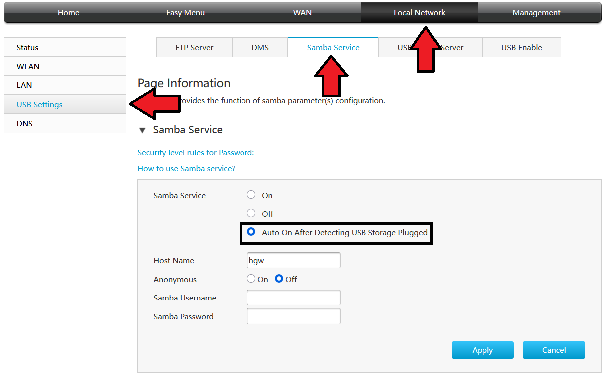

+++
date = '2025-02-10T01:05:10+03:00'
draft = true
title = "How I Use 'Samba' as a Music Streaming Solution"
+++

It was time for me to stop the ads that appeared on Spotify, which I have been using for years. Actually, I had a lot of different alternatives, like modded clients with adblock plugins, open-source frontend music applications. I tried a lot of them, but I found myself in another search, I didn't have an incredibly large music archive, they were all about ~1000 songs, and because it wouldn't take up a lot of space - I'm a little short of storage :) - I decided to host it myself. I'll talk about how I did it, what tools I used, and whether I was satisfied.

## What is 'Samba' and 'SMB' really?

Samba and SMB are considered to be the same as each other and are confused a lot. Actually, it's just this;

SMB is a protocol and is used to share resources (such as printers, files) on a network. Samba is an open source software that uses the SMB protocol. It works on operating systems such as Windows, Linux and Unix and allows it to share files on these systems and resources connected to the systems.

## How can you open 'Samba'?

First of all, you should log in to your Modem interface, mostly you can log in to this interface with the address '192.168.1.1', but if you can't log in, you can access this interface by running 'ipconfig' on Windows and typing the 'Default Gateway' value into your address bar.

I am using the 'ZXHN H298A' model modem and I will provide an explanation accordingly, the interface may be different for you, but the names will not change. First of all, I inserted a USB memory stick into the USB port on my modem. After logging in to the modem interface, if you do the steps I have shown below and activate the Samba Service On or 'Auto On After Detecting USB Storage Plugged In' setting, Samba will be activated on your modem. You can access the Samba file system, i.e. your USB memory, by clicking the Win + R keys and logging in as '\\\DefaultGateway' example '\\\192.168.1.1'. Now you can access every file you put into your USB drive from every device in the network that supports the SMB protocol. I uploaded my music archive into it.

After reaching the Samba folder, when you select your music library and drag it to the desired music player, that music player will detect that the files come from Samba and play the music from there.

## Tools and Thoughts

I have tried quite a lot of tools and applications in this process to have a great music experience. I am very satisfied with my current setup and I will talk about a few tools I have used, my experiences and my thoughts.

-[Spotify](https://open.spotify.com/), even though I don't want to use it anyway, the easiest way to collect all the songs together to create a music archive from scratch is through Spotify. Here I have added the songs into a playlist according to their category. I used Spotify for this purpose.

- [Spotify Dedup](https://spotify-dedup.com/), this site deletes the duplicate songs from the playlists. I can say that it has been quite useful to me.

- [Spotify Downloader](https://github.com/WilliamSchack/Spotify-Downloader), I downloaded my songs in bulk thanks to this application. Most of my songs are downloaded at 256kb/s, if you already have a Spotify Premium account, you can check out; \
   -- [Soggy](https://github.com/Rafiuth/Soggfy) and [OnTheSpot](https://github.com/justin025/onthespot)

  - It is stated in the documentation that they downloaded it as 320kb/s when you connected as premium.

- [MusicBee](https://www.getmusicbee.com/), this is the music player I was most satisfied with among the other music players I tried. I definitely recommend it. Apart from MusicBee, I have tried [Foobar2000](https://www.foobar2000.org/), [WACUP](https://getwacup.com/), [Harmonoid](https://harmonoid.com/) applications. All of them will do your job more than enough, but I was more interested in MusicBee because of its interface and ease of use.

## Final

I can say that making this archive has helped me a lot. Apart from storing all my music by myself and listening to it without ads or internet whenever I want, I can continue to listen to the same archive in my car by removing my USB memory stick from the modem when I go out. During this process, the Samba feature is also turned off because I selected the "Auto On After Detecting USB Storage Plugged In" option via the modem.

**\-The links and the apps I share are just for sharing information. I don’t have any ads or partnerships.\-**
